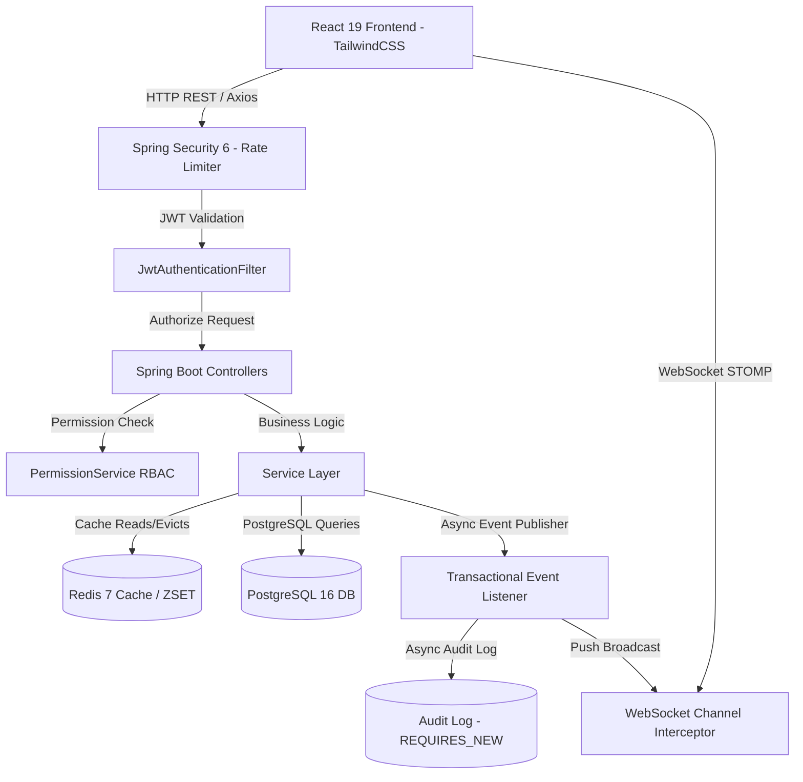
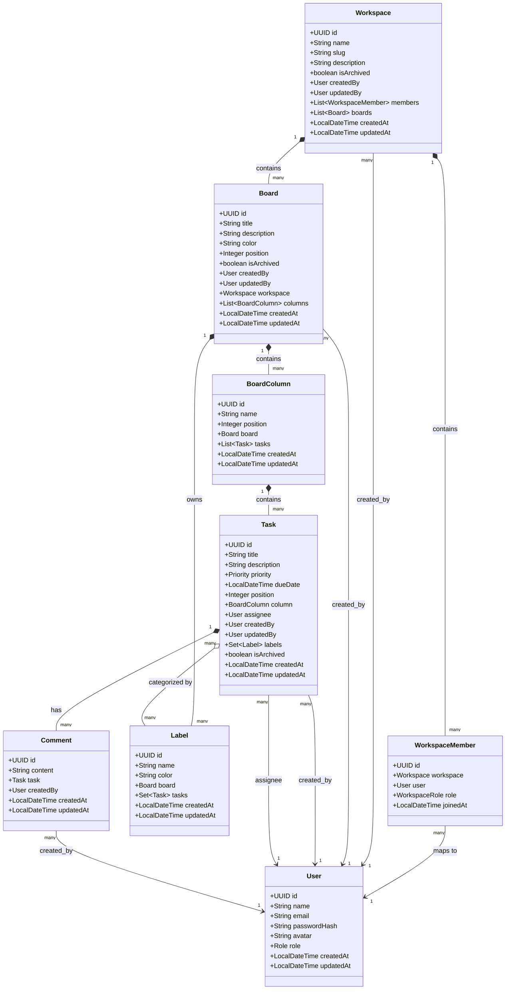
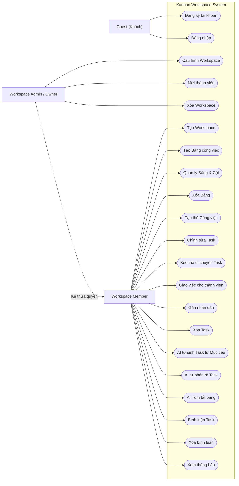
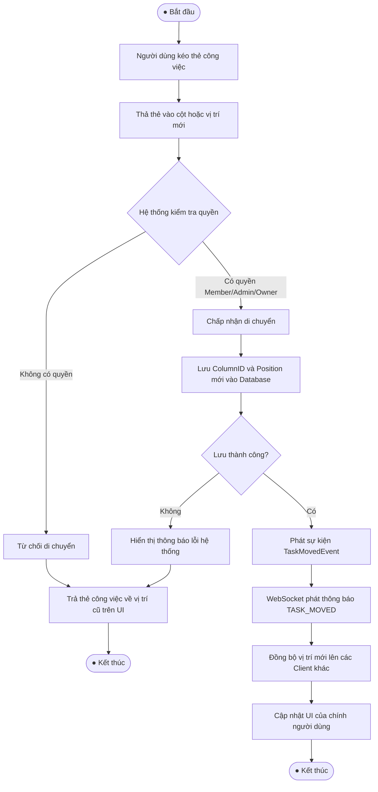
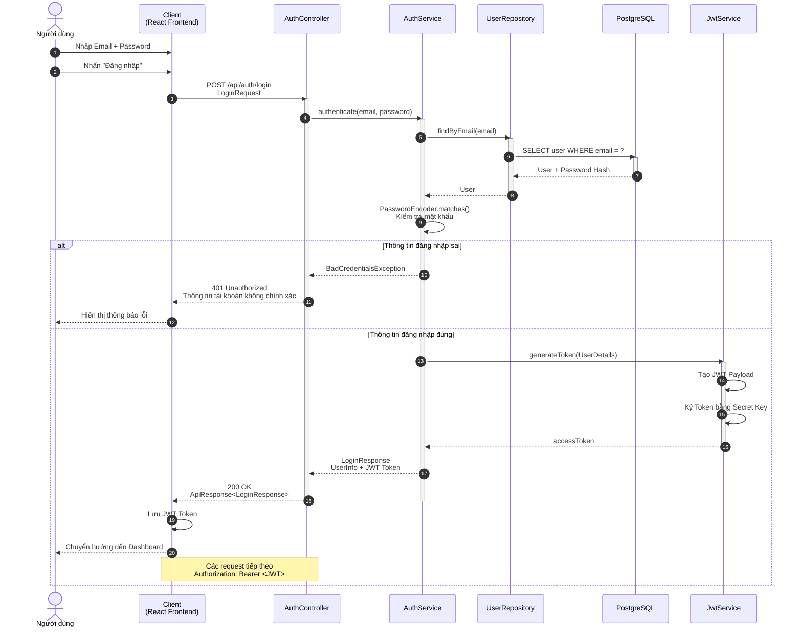

# ⚡ Fwork — Enterprise Real-time Kanban Collaboration Platform

[](./PROJECT_REPORT.md)
[](https://openjdk.org/projects/jdk/21/)
[](https://spring.io/projects/spring-boot)
[](https://react.dev/)
[](https://vitejs.dev/)
[](https://www.postgresql.org/)
[](https://redis.io/)

**Fwork** là nền tảng quản lý dự án và cộng tác nhóm thời gian thực (Real-time Enterprise Kanban Collaboration Platform) chuẩn doanh nghiệp. Hệ thống cung cấp khả năng quản trị luồng công việc đa cấp, đồng bộ tức thì qua WebSocket STOMP, lập kế hoạch thông minh bằng AI, bảo mật chuẩn RBAC và kiến trúc chịu tải phân tán cao.

---

## 📋 Mục lục

1. [Tính năng nổi bật](#-tính-năng-nổi-bật)
2. [Công nghệ sử dụng (Tech Stack)](#-công-nghệ-sử-dụng-tech-stack)
3. [Kiến trúc Hệ thống (Architecture)](#-kiến-trúc-hệ-thống-architecture)
4. [Cấu trúc Thư mục (Directory Structure)](#-cấu-trúc-thư-mục-directory-structure)
5. [Cấu hình Môi trường (.env)](#-cấu-hình-môi-trường-env)
6. [Hướng dẫn Khởi chạy (Quick Start)](#-hướng-dẫn-khởi-chạy-quick-start)
7. [Tài liệu API & Swagger UI](#-tài-liệu-api--swagger-ui)
8. [Kiểm thử & Đảm bảo Chất lượng](#-kiểm-thử--đảm-bảo-chất-lượng)
9. [Tài liệu & Sơ đồ Thiết kế](#-tài-liệu--sơ-đồ-thiết-kế)

---

## 🚀 Tính năng nổi bật

### 🗂️ 1. Quản lý Kanban Đa cấp & Drag-and-Drop
- Quản lý phân cấp linh hoạt: `Workspace` ➔ `Board` ➔ `Column` ➔ `Task`.
- Kéo thả thẻ công việc và sắp xếp lại thứ tự cột mượt mà với `@dnd-kit/core` & `@dnd-kit/sortable`.
- Đánh dấu hoàn thành task thông minh: Tự động chuyển task vào cột **Done** hoặc trả về cột ban đầu khi bỏ tick.

### ⚡ 2. Cộng tác Thời gian thực (Real-time Collaboration)
- Tích hợp **WebSocket STOMP Broker** trên kênh `/topic/boards/{boardId}`.
- Tự động đồng bộ giao diện khi người dùng khác tạo task, di chuyển cột, đổi priority hoặc viết comment mà không cần tải lại trang.
- Đã mã hóa bảo mật tầng WebSocket: Kiểm tra JWT frame `CONNECT` và phân quyền Workspace khi `SUBSCRIBE`.

### 🤖 3. Trợ lý Lập kế hoạch AI (AI-Powered Sprint Planning)
- Sử dụng Google Gemini AI để sinh tự động danh sách công việc (`Generate tasks with AI`) từ mô tả mục tiêu.
- Phân rã nhiệm vụ phức tạp (`AI Breakdown`) thành các checklist nhỏ gọn, ưu tiên rõ ràng.

### 🛡️ 4. Phân quyền Trung tâm & Bảo mật Nâng cao (RBAC & Security)
- Hệ thống phân quyền 3 cấp độ: `OWNER`, `ADMIN`, `MEMBER` qua lớp dịch vụ tập trung [PermissionService](./backend/src/main/java/com/intern/fwork/services/PermissionService.java).
- Mã hóa Token Lời mời Workspace bằng băm **SHA-256**, tự động hết hạn sau 7 ngày.
- Nhật ký Kiểm toán Độc lập (**Security Audit Logging**) lưu trữ các hành vi nhạy cảm (Login, Đổi role, Transfer Ownership) với giao dịch `Propagation.REQUIRES_NEW`.

### ⏱️ 5. Rate Limiting Phân tán & Redis Caching
- Giới hạn tần suất truy cập bằng thuật toán **Sliding Window Counter** trên Redis `ZSET` (HTTP 429 Too Many Requests) cùng cơ chế tự động Fallback In-Memory khi Redis sự cố.
- Bộ đệm hai tầng cho Workspace, Board và Dashboard giảm tải tới 80% truy vấn DB.

---

## 🛠️ Công nghệ sử dụng (Tech Stack)

### Frontend
- **Framework & Build:** React 19, Vite 8, React Router v7.
- **Styling & Icons:** TailwindCSS v4 (Custom Purple/Indigo Theme), Lucide React, Framer Motion.
- **State & Drag-and-Drop:** `@dnd-kit/core`, `@dnd-kit/sortable`, Axios Interceptors (Xử lý 401 tự động).
- **Real-time Client:** `@stomp/stompjs` + `sockjs-client`.

### Backend
- **Core Framework:** Java 21, Spring Boot 4.1.0, Spring Security 6, Spring Data JPA (Hibernate ORM).
- **Database & Cache:** PostgreSQL 16 (Physical Indexing & EntityGraph), Redis 7 (Spring Data Redis).
- **Security & JWT:** JJWT 0.12.7, BCrypt Password Encoder, SHA-256 Hashing.
- **Observability & Tools:** Spring Boot Actuator, Micrometer Prometheus, Lombok, MapStruct.

---

## 🏗️ Kiến trúc Hệ thống (Architecture)



---

## 📁 Cấu trúc Thư mục (Directory Structure)

```text
Fwork/
├── backend/                         # Source code Backend (Spring Boot)
│   ├── src/main/java/com/intern/fwork/
│   │   ├── config/                  # Security, Web, Redis, WebSocket, OpenAPI
│   │   ├── controllers/             # REST API Endpoints
│   │   ├── dtos/                    # Request & Response DTOs
│   │   ├── entities/                # JPA Domain Entities
│   │   ├── enums/                   # Role, WorkspaceRole, Priority
│   │   ├── exceptions/              # Global Exception Handler
│   │   ├── ratelimit/               # Sliding Window Redis & In-Memory Rate Limiter
│   │   ├── repositories/            # Spring Data JPA Repositories
│   │   ├── security/                # JwtService, JwtFilter, CustomUserDetails
│   │   └── services/                # Business & Permission Services
│   └── src/test/java/               # 54 Automated Integration & Unit Tests
├── frontend/                        # Source code Frontend (React / Vite)
│   ├── src/
│   │   ├── components/              # Board, Task, Layout, UI Primitives
│   │   ├── context/                 # Auth & Board React Contexts
│   │   ├── hooks/                   # useBoard, useWorkspace Custom Hooks
│   │   ├── lib/                     # Axios API Client & STOMP Socket Client
│   │   ├── pages/                   # Dashboard, Kanban Board, MyTasks, Settings
│   │   └── index.css                # Custom Purple Brand Design System
│   ├── index.html                   # Entry HTML with Fwork branding
│   └── package.json
├── docker-compose.yml               # Production Container Orchestration
├── PROJECT_REPORT.md                # Báo cáo tổng kết dự án
└── README.md                        # Tài liệu hướng dẫn sử dụng
```

---

## ⚙️ Cấu hình Môi trường (.env)

Tạo file `.env` tại thư mục gốc dự án:

```env
# DATABASE POSTGRESQL
DB_HOST=localhost
DB_PORT=5432
DB_NAME=Fwork
DB_USERNAME=postgres
DB_PASSWORD=postgres

# REDIS
REDIS_HOST=localhost
REDIS_PORT=6379

# SECURITY & JWT
JWT_SECRET=B9KWlBRILyT59ftELaWsuZsXQb9/piaorNS/SuX4IMzgTFNphg7wVfzhfasqpWehb83ApfZee3gX1/UV1EMxoA==
JWT_EXPIRATION=900000
JWT_REFRESH_EXPIRATION=604800000

# GEMINI AI INTEGRATION
GEMINI_API_KEY=your_gemini_api_key_here
```

---

## 🚀 Hướng dẫn Khởi chạy (Quick Start)

### Cách 1: Khởi chạy bằng Docker Compose (Khuyên dùng)

Yêu cầu: Đã cài đặt **Docker** và **Docker Compose**.

```bash
# 1. Clone repository và chuyển vào thư mục dự án
cd Fwork

# 2. Tạo file .env từ mẫu
cp .env.example .env

# 3. Khởi chạy tất cả các dịch vụ (Database, Redis, Backend, Frontend)
docker compose up --build -d
```

Trạng thái dịch vụ sau khi khởi chạy:
- **Frontend App:** `http://localhost:3000`
- **Backend API Base:** `http://localhost:8080/api`
- **Swagger UI Docs:** `http://localhost:8080/swagger-ui/index.html`
- **Prometheus Metrics:** `http://localhost:8080/actuator/prometheus`

---

### Cách 2: Khởi chạy Cục bộ (Development Mode)

#### 1. Khởi động PostgreSQL & Redis:
```bash
docker run --name fwork-postgres -e POSTGRES_DB=Fwork -e POSTGRES_PASSWORD=postgres -p 5432:5432 -d postgres:16
docker run --name fwork-redis -p 6379:6379 -d redis:7
```

#### 2. Khởi động Backend (Spring Boot):
```bash
cd backend
# Windows
.\mvnw.cmd spring-boot:run

# Linux / macOS
./mvnw spring-boot:run
```

#### 3. Khởi động Frontend (React / Vite):
```bash
cd frontend
npm install
npm run dev
```

---

## 📖 Tài liệu API & Swagger UI

Hệ thống đã tích hợp OpenAPI 3.0. Truy cập **Swagger UI** tại địa chỉ:
`http://localhost:8080/swagger-ui/index.html`

Các API chính:
- `POST /api/auth/register` — Đăng ký tài khoản
- `POST /api/auth/login` — Đăng nhập & lấy Bearer Token
- `GET /api/workspaces` — Danh sách Workspace của người dùng
- `GET /api/workspaces/{id}/boards` — Danh sách Board trong Workspace
- `GET /api/boards/{id}` — Chi tiết Board & Cột dữ liệu
- `PATCH /api/tasks/{id}/move` — Di chuyển vị trí / Cột của Task
- `POST /api/boards/{id}/ai/generate-tasks` — Gợi ý lập kế hoạch bằng AI

---

## 🧪 Kiểm thử & Đảm bảo Chất lượng

Dự án đạt tỷ lệ kiểm thử thành công tuyệt đối trên bộ 54 Automated Integration Tests:

```text
[INFO] Results:
[INFO] 
[INFO] Tests run: 54, Failures: 0, Errors: 0, Skipped: 0
[INFO] ------------------------------------------------------------------------
[INFO] BUILD SUCCESS
[INFO] ------------------------------------------------------------------------
```

### Các test suites đã kiểm thử:
- `SecurityMatrixIntegrationTest`: Kiểm thử ma trận phân quyền RBAC.
- `TaskPaginationIntegrationTest`: Kiểm thử phân trang & tối ưu hóa N+1 queries.
- `CacheIntegrationTest`: Kiểm thử bộ đệm Redis.
- `NotificationIntegrationTest`: Kiểm thử sự kiện bất đồng bộ & thông báo.
- `InvitationIntegrationTest`: Kiểm thử băm SHA-256 & Transfer Ownership.
- `RateLimitIntegrationTest`: Kiểm thử giới hạn 429 Too Many Requests.
- `KanbanEndToEndIntegrationTest`: Kiểm thử E2E luồng công việc Kanban.

---

## 📐 Tài liệu & Sơ đồ Thiết kế (UML Diagrams)

Để phục vụ cho báo cáo đồ án và hiểu cấu trúc hệ thống, dưới đây là các sơ đồ UML được thiết kế và vẽ trực tiếp bằng công cụ **Mermaid** (được hiển thị trực quan trực tiếp trên trình xem Markdown):

### 📊 1. Sơ đồ lớp chi tiết (Class Diagram)
Mô tả cấu trúc thực thể, thuộc tính và mối quan hệ quan hệ của cơ sở dữ liệu hệ thống (JPA Entities):



---

### 🎯 2. Sơ đồ Use Case (Use Case Diagram)
Thể hiện các vai trò của người dùng (Khách, Thành viên, Admin/Owner) tương tác với các khối chức năng chính:



---

### 🔄 3. Sơ đồ hoạt động (Activity Diagram - Drag & Drop Task)
Mô tả quy trình nghiệp vụ kéo thả cập nhật trạng thái công việc trên bảng Kanban:



---

### 💬 4. Biểu đồ tuần tự (Sequence Diagram - Authentication & Login)
Mô tả chi tiết luồng dữ liệu truyền tin xác thực tài khoản giữa Client, Controller, Service, DB và cấp mã JWT token:



---

---
